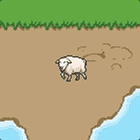
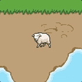
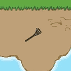
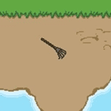

# Entity Types

In the MGE, there are three types of [[entities|entities]]. Each has a `primary_id_type` (determined by the type of tile being placed):

- `0` = [[#Tile Entity|tile]] (`tileset`)
- `1` = [[#Animation Entity|animation]] (`animation`)
- `2` = [[#Character Entity|character]] (`entity_type`)

For the first two types (tile and animation), the tile will rotate when the entity changes which direction it is "facing," whereas the last type (character) will instead choose the correct [[animations|animation]] among those it was [[entity_management_system|assigned]] (north, south, east, or west). Therefore entities that are meant to have standard character animations (like the sheep below) or that need to retain their appearance when moving around the [[maps|map]] (like the rake below) *must* be the third type.

| Rotating Tiles                             | Assigned Animations                    |
| :----------------------------------------- | :------------------------------------- |
| sheep (animation)                          | sheep (character)                      |
|  |  |
| rake (tile)                                | rake (character)                       |
|   |   |

In addition, there is currently no way to control animations with scripts unless the entity is a character entity. (See the the modem and bookcase in Chapter 1 of the Black Mage Game.)

## Tile Entity

If you place a static (unanimated) tile from a [[tilesets|tileset]] onto an object layer in a Tiled [[maps|map]], it will become a **tile entity**.

::: tip NOTE
If the tile's `Class` property is defined within `entity_types.json`, it will instead become a [[#Character Entity|character entity]].
:::

- **`primary_id_type`**: `0` (`tileset`)
- **`primary_id`**: the `id` of the tileset the entity is using
- **`secondary_id`**: the `id` of the tile on the tileset (the Nth tile, counting left to right and top to down, 0-indexed)

These are a simple way of making props interactable.

If you don't want an interactable prop to be be Y-indexed with other entities when drawn, you could instead put the prop in the map geometry itself and create a [[#Null Entity|"null entity"]] for the interactable aspects.

### Null Entity

A null entity is a [[#Tile Entity|tile entity]] whose tile is entirely transparent. They're useful for implementing scripting behaviors not directly supported by the MGE, such as having an entity procedurally chase a moving (invisible) target.

A common use is to enable interaction behavior for things that aren't themselves entities. To do this, place a null entity on the map wherever you want interaction behavior to happen, then use the null entity's [[scripts#`on_interact`|`on_interact`]] script slot for the interaction behavior.

**Disadvantages**: The null entity can be hacked into another tile (presumably one with pixel data), in which case a new object will seemingly appear out of nowhere.

You cannot click on transparent pixels in Tiled. To select a null entity, you'll need to use the Layers pallet. To move one, change its X and Y values in the properties pane once you've selected it.

## Animation Entity

If you place a animated tile from a [[tilesets|tileset]] onto an object layer in a Tiled [[maps|map]], it will become an **animation entity**.

::: tip NOTE
If the tile's `Class` property is defined within `entity_types.json`, it will instead become a [[#Character Entity|character entity]].
:::

- **`PrimaryIdType`**: `1` (`animation`)
- **`PrimaryId`**: the `id` of the animation the entity is playing
- **`SecondaryId`**: does nothing

When the game is [[encoder|encoded]], all animations are shoved together into a single list, so the `id` for `PrimaryId` is regularly subject to change. Therefore, you will never want to use the `PrimaryId` to choose a specific animation.

Animation entities are most useful for animated props, e.g. a water fountain, a torch flickering on a wall, a birthday cake with a moving candle flame. Such entities need not use any of the [[entities#Entity Properties|entity properties]] available to them, though they could.

While NPCs will likely need to be character entities, simpler ones might work perfectly well as animation entities, e.g. WOPR in the Black Mage Game.

## Character Entity

If you place a tile onto an object layer, and the `Class` (formerly `Type`) property of the tile has been defined in `entity_types.json`, it will become an **character entity**.

- **`PrimaryIdType`**: `2` (`entity_type`)
- **`PrimaryId`**: the `id` of the entity within `entity_types.json`
- **`SecondaryId`**: does nothing

You need not manipulate `PrimaryId` to alter the appearance of a character entity. Instead, you can use [[actions|actions]] that change the `entity_type` value to one of the ones defined within `entity_types.json`.

What's special about character entities is that they can have a number of [[animations|animations]](animations) [[entity_management_system|assigned]] to them and they will switch animations automatically depending on context (walking or not, facing north/south/east/west, etc.), as well as having other attributes, like a default portrait image. **NPCs will therefore likely be this type.**

In the MGE, character entities will default to their idle animation regardless of the tile that was placed Tiled. (I.e. if you use a "walking animation" tile for the entity on the Tiled map, the entity will appear to be walking in Tiled, but not within the MGE.)

Character entities will face the north by default, but if the tile placed has an animation that has been [[entity_management_system|assigned to a NSEW direction and a purpose]], the entity will instead face the direction associated with that tile's assignment.
