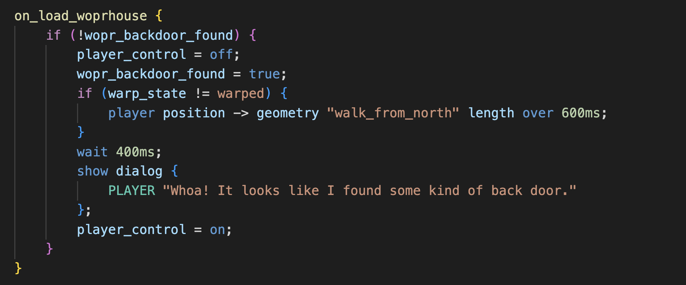

# MageGameScript Documentation and Content Creation Guide

Content creation guide for the "Mage Game Engine" (MGE) using MageGameScript (MGS), a custom domain-specific language.

Devs also see: [[TODOS|TODOS]]

## Overview

1. [[introduction_to_mgs|Introduction to MGS]]
	+ [[introduction_to_mgs#Philosophy|Philosophy]]
	+ [[introduction_to_mgs#New Features|New Features]]
	+ [[introduction_to_mgs#WIP Features|WIP Features]]
	+ [[introduction_to_mgs#Using the Parser|Using the Parser]]
2. [[what_youll_need|What You'll Need]]
	* [[what_youll_need#Software|Software]]
	* [[what_youll_need#Files|Files]]
	* [[what_youll_need#To Run the Game|To Run the Game]]
	* [[what_youll_need#Syntax Colors|Syntax Colors]]
3. [[general_process|General Process]]
	* [[general_process#Entities|Entities]]
	* [[general_process#Maps|Maps]]
	* [[general_process#Dialog Skins|Dialog Skins]]
	* [[general_process#Game Logic|Game Logic]]
	* [[general_process#Encode Game|Encode Game]]
	* [[general_process#Play Test|Play Test]]
4. [[jargon_and_syntax|Documentation Jargon and Syntax]]
	* [[jargon_and_syntax#General|General]]
	* [[jargon_and_syntax#Style Guide|Style Guide]]
	* [[jargon_and_syntax#Jargon|Jargon]]
	* [[jargon_and_syntax#Dictionary Syntax|Dictionary Syntax]]
5. [[syntax_scopes|MGS Syntax Scopes]]
	* [[syntax_scopes#Project Scope|Project Scope]]
	* [[syntax_scopes#Map Scope|Map Scope]]
	* [[syntax_scopes#File Scope|File Scope]]
	* [[syntax_scopes#Script Scope|Script Scope]]
	* [[syntax_scopes#Session Scope|Session Scope]]
	* [[syntax_scopes#Syntax Contexts|Syntax Contexts]]

## Assets

1. [[tilesets|Tilesets]]
	* [[tilesets#Map Tilesets|Map Tilesets]]
	* [[tilesets#Spritesheets|Spritesheets]]
	* [[tilesets#Other Kinds of Tilesets|Other Kinds of Tilesets]]
	* [[tilesets#MGE Considerations|MGE Considerations]]
	* [[tilesets#Creating a Tileset JSON File|Creating a Tileset JSON File]]
2. [[animations|Animations]]
	* [[animations#MGE Animation Considerations|MGE Animation Considerations]]
	* [[animations#Animation Types|Animation Types]]
	* [[animations#Animation Transitions and Vamping|Animation Transitions and Vamping]]
	* [[animations#MGE Animation Timing|MGE Animation Timing]]
	* [[animations#Assigning Animations to Character Entities|Assigning Animations to Character Entities]]
3. [[maps|Maps]]
	* [[maps#Creating a Map JSON File|Creating a Map JSON File]]
	* [[maps#Tile Layers|Tile Layers]]
	* [[maps#Object Layers|Object Layers]]
	* [[maps#Map Properties|Map Properties]]
	* [[maps#Map Loads|Map Loads]]
	* [[maps#Map Properties|Map Properties]]
4. [[vector_objects|Vector Objects]]
	* [[vector_objects#Vector Origins|Vector Origins]]
	* [[vector_objects#Coordinate Overflow|Coordinate Overflow]]
	* [[vector_objects#Coordinate Considerations|Coordinate Considerations]]
5. [[entities|Entities]]
	* [[entities#Entity Properties|Entity Properties]]
	* Relative References
6. [[entity_types|Entity Types]]
	* [[entity_types#Tile Entity|Tile Entity]]
	* [[entity_types#Animation Entity|Animation Entity]]
	* [[entity_types#Character Entity|Character Entity]]
7. [[entity_management_system|Entity Management System]]
	* [[entity_management_system#New `entity_type`|New `entity_type`]]
	* [[entity_management_system#Existing `entity_type`|Existing `entity_type`]]
	* [[entity_management_system#Animations Pane|Animations Pane]]
	* [[entity_management_system#Tileset Pane|Tileset Pane]]
	* [[entity_management_system#Assigning Animations|Assigning Animations]]

## Types and Structure

1. [[primitive_types|Primitive Types]]
	* [[primitive_types#String|String]]
		+ [[primitive_types#Bareword|Bareword]]
		+ [[primitive_types#Quoted String|Quoted String]]
	* [[primitive_types#Number|Number]]
		+ [[primitive_types#Number Literal|Number Literal]]
		+ [[primitive_types#Duration|Duration]]
		+ [[primitive_types#Distance|Distance]]
		+ [[primitive_types#Quantity|Quantity]]
		+ [[primitive_types#Color|Color]]
	* [[primitive_types#Boolean|Boolean]]
	* [[primitive_types#Constant|Constant]]
2. [[dialog_and_serial_dialog_strings|Dialog and Serial Dialog Strings]]
	* [[dialog_and_serial_dialog_strings#Wrapping|Wrapping]]
	* [[dialog_and_serial_dialog_strings#Sanitization|Sanitization]]
	* [[dialog_and_serial_dialog_strings#Printing Current Values|Printing Current Values]]
		+ [[dialog_and_serial_dialog_strings#Print Variable Value|Print Variable Value]]
		+ [[dialog_and_serial_dialog_strings#Print Entity Name|Print Entity Name]]
	* [[dialog_and_serial_dialog_strings#Ansi Escape Sequences|Ansi Escape Sequences]]
3. [[identifiers|Identifiers]]
	* [[identifiers#Sigils|Sigils]]
	* [[identifiers#Vs Strings|Vs Strings]]
	* [[identifiers#Identifier Categories|Identifier Categories]]
		+ [[identifiers#Entity Identifier|Entity Identifier]]
		+ [[identifiers#Geometry Identifier|Geometry Identifier]]
4. [[expressions_and_operators|Expressions and Operators]]
	* [[expressions_and_operators#Expressions|Expressions]]
	* [[expressions_and_operators#Assignment Operation|Assignment Operation]]
	* [[expressions_and_operators#Operands|Operands]]
		+ [[expressions_and_operators#Getables vs Setables|Getables vs Setables]]
	* [[expressions_and_operators#Int Expressions|Int Expressions]]
		+ [[expressions_and_operators#Int Binary Expression|Int Binary Expression]]
		+ [[expressions_and_operators#Int Operands|Int Operands]]
	* [[expressions_and_operators#Bool Expressions|Bool Expressions]]
		+ [[expressions_and_operators#Bool Unary Expression|Bool Unary Expression]]
		+ [[expressions_and_operators#Bool Comparison|Bool Comparison]]
		+ [[expressions_and_operators#Bool Binary Expression|Bool Binary Expression]]
		+ [[expressions_and_operators#Bool Operands|Bool Operands]]
		+ [[expressions_and_operators#Button Names|Button Names]]
		+ [[expressions_and_operators#String Checkables|String Checkables]]
5. [[macros|Macros]]
	* [[macros#Include|Include]]
	* [[macros#Rand|Rand]]
	* [[macros#RNG|RNG]]
	* [[macros#Debug|Debug]]
	* [[macros#Copy Script|Copy Script]]
6. [[fns|Fns]]
	* [[fns#Fn Definition|Fn Definition]]
	* [[fns#Fn Literal|Fn Literal]]
	* [[fns#Fn Call|Fn Call]]
	* [[fns#Example|Example]]
7. [[state|State]]
	* [[state#Warp State String|Warp State String]]
	* [[state#Integer Variables|Integer Variables]]
	* [[state#Save Flags|Save Flags]]
	* [[state#Engine Flags|Engine Flags]]
	* [[state#Save Data|Save Data]]

## Root Level Definitions

1. [[constants|Constants]]
	* [[constants#Constant Definition|Constant Definition]]
	* [[constants#Use|Use]]
	* [[constants#Vs Integer Variable|Vs Integer Variable]]
2. [[dialog_and_serial_dialog_settings|Dialog and Serial Dialog Settings]]
	* [[dialog_and_serial_dialog_settings#Precedence|Precedence]]
	* [[dialog_and_serial_dialog_settings#Dialog Settings|Dialog Settings]]
	* [[dialog_and_serial_dialog_settings#Serial Dialog Settings|Serial Dialog Settings]]
3. [[dialogs|Dialogs]]
	* [[dialogs#Dialog Definition|Dialog Definition]]
	* [[dialogs#Dialog Literal|Dialog Literal]]
	* [[dialogs#Dialog|Dialog]]
		+ [[dialogs#Dialog Identifier|Dialog Identifier]]
		+ [[dialogs#Dialog Parameter|Dialog Parameter]]
		+ [[dialogs#Dialog Message|Dialog Message]]
		+ [[dialogs#Dialog Option|Dialog Option]]
4. [[serial_dialogs|Serial Dialogs]]
	* [[serial_dialogs#Serial Dialog Definition|Serial Dialog Definition]]
	* [[serial_dialogs#Serial Dialog Literal|Serial Dialog Literal]]
	* [[serial_dialogs#Serial Dialog|Serial Dialog]]
		* [[serial_dialogs#Serial Dialog Parameter|Serial Dialog Parameter]]
		* [[serial_dialogs#Serial Dialog Message|Serial Dialog Message]]
		* [[serial_dialogs#Serial Dialog Option|Serial Dialog Option]]
5. [[scripts|Scripts]]
	* [[scripts#Script Definitions|Script Definitions]]
	* [[scripts#Script Literal|Script Literal]]
	* [[scripts#Script Body Items|Script Body Items]]
	* [[scripts#`null_script`|`null_script`]]
	* [[scripts#Script Slots|Script Slots]]
		+ [[scripts#`on_interact`|`on_interact`]]
		+ [[scripts#`on_tick`|`on_tick`]]
		+ [[scripts#`on_load`|`on_load`]]
		+ [[scripts#`on_look`|`on_look`]]
		+ [[scripts#One Slot, One Thread|One Slot, One Thread]]

## Script Body Items

1. [[script_control_flow|Script Control Flow]]
	* [[script_control_flow#Return|Return]]
	* [[script_control_flow#If / Else Chain|If / Else Chain]]
	* [[script_control_flow#If Single|If Single]]
	* [[script_control_flow#While Block|While Block]]
	* [[script_control_flow#Do While Block|Do While Block]]
	* [[script_control_flow#For Block|For Block]]
	* [[script_control_flow#Label Definitions|Label Definitions]]
2. [[json_literals|JSON Literals]]
3. [[arrays|Arrays]]
	* [[arrays#Array Indices|Array Indices]]
	* [[arrays#Array Action Phrases|Array Action Phrases]]
	* [[arrays#Array Methods|Array Methods]]
	* [[arrays#Assign Array Value at Index|Assign Array Value at Index]]
4. [[commands|Commands]]
	* [[commands#Interpretation|Interpretation]]
	* [[commands#Default Commands|Default Commands]]
	* [[commands#Command Actions|Command Actions]]
	* [[commands#Aliases|Aliases]]
5. [[action_param_expansions|Action Param Expansions]]
	* [[action_param_expansions#Spreading|Spreading]]
	* [[action_param_expansions#Rand Macro|Rand Macro]]
	* [[action_param_expansions#Expansion Rules|Expansion Rules]]
6. [[actions|Actions]]
	* [[actions#Game Control|Game Control]]
		+ [[actions#Save slot|Save slot]]
		+ [[actions#Load Slot|Load Slot]]
		+ [[actions#Erase Slot|Erase Slot]]
		+ [[actions#Non-Blocking Delay|Non-Blocking Delay]]
		+ [[actions#Blocking Delay|Blocking Delay]]
		+ [[actions#Load Map|Load Map]]
	* [[actions#Dialogs Management|Dialogs Management]]
		+ [[actions#Show Dialog|Show Dialog]]
		+ [[actions#Close Dialog|Close Dialog]]
		+ [[actions#Show Serial Dialog|Show Serial Dialog]]
		+ [[actions#Concat Serial Dialog|Concat Serial Dialog]]
		+ [[actions#Close Serial Dialog|Close Serial Dialog]]
	* [[actions#Script Control|Script Control]]
		+ [[actions#Run Script|Run Script]]
		+ [[actions#Pause or Unpause Script Slot|Pause or Unpause Script Slot]]
		+ [[actions#Jump to Action Index|Jump to Action Index]]
		+ [[actions#Jump to Label|Jump to Label]]
	* [[actions#Position Assignment|Position Assignment]]
		+ [[actions#Movable (Assignment)|Movable (Assignment)]]
		+ [[actions#Coordinate (Assignment)|Coordinate (Assignment)]]
	* [[actions#Position Over Time|Position Over Time]]
		+ [[actions#Movable (Over Time)|Movable (Over Time)]]
		+ [[actions#Coordinate (Over Time)|Coordinate (Over Time)]]
		+ [[actions#Forever|Forever]]
	* [[actions#Choreography|Choreography]]
		+ [[actions#Play Entity Animation|Play Entity Animation]]
		+ [[actions#Fade Camera In or Out|Fade Camera In or Out]]
		+ [[actions#Shake Camera|Shake Camera]]
	* [[actions#Assign a Value|Assign a Value]]
		+ [[actions#Assign Int Value|Assign Int Value]]
			- [[actions#Int Setables|Int Setables]]
		+ [[actions#Change Int Value|Change Int Value]]
		+ [[actions#Assign Bool Value|Assign Bool Value]]
			- [[actions#Bool Setables|Bool Setables]]
			- [[actions#Lights|Lights]]
		+ [[actions#Assign String Value|Assign String Value]]
			- [[actions#String Setables|String Setables]]
		+ [[actions#Assign Script Value|Assign Script Value]]
			- [[actions#Script Setables|Script Setables]]
		+ [[actions#Assign Direction Value|Assign Direction Value]]
	* [[actions#Other Actions|Other Actions]]

## Techniques

1. [[actors|Actors]]
2. [[cutscenes|Cutscenes]]
3. [[doors|Doors]]
4. [[handlers|Handlers]]
5. [[hiding_an_entity|Hiding an Entity]]
6. [[hint_systems|Hint Systems]]

## Technical

1. [[hex_editor|Hex Editor]]
	* [[hex_editor#Opening the Hex Editor|Opening the Hex Editor]]
	* [[hex_editor#Selecting a Value|Selecting a Value]]
	* [[hex_editor#Changing a Value|Changing a Value]]
2. [[terminal|Terminal]]
3. [[mge_vm|MGE VM]]
	* [[mge_vm#Download the VM image|Download the VM image]]
	* [[mge_vm#VirtualBox|VirtualBox]]
	* [[mge_vm#To Run the Game|To Run the Game]]
	* [[mge_vm#Game Development|Game Development]]
	* [[mge_vm#Raw Game Data Folders|Raw Game Data Folders]]
4. [[encoder|Encoder]]
	* [[encoder#`game.dat`|`game.dat`]]
	* [[encoder#CLI Encoder|CLI Encoder]]
	* [[encoder#Web Encoder|Web Encoder]]
		+ [[encoder#Entity Manager|Entity Manager]]
	* [[encoder#Debugging|Debugging]]
		+ [[encoder#Encoder Console|Encoder Console]]
		+ [[encoder#Inspecting WIP Data|Inspecting WIP Data]]
		+ [[encoder#Kaitai|Kaitai]]
5. [[debug_tools|Debug Tools]]
	* [[debug_tools#Debug Mode|Debug Mode]]
		+ [[debug_tools#Debug Entities|Debug Entities]]
		+ [[debug_tools#Debug Scripting|Debug Scripting]]
		+ [[debug_tools#Debug Techniques|Debug Techniques]]
	* [[debug_tools#Vector View|Vector View]]
6. [[updating_the_hardware|Updating the Hardware]]
	* [[updating_the_hardware#Game Engine|Game Engine]]
	* [[updating_the_hardware#`game.dat`|`game.dat`]]
