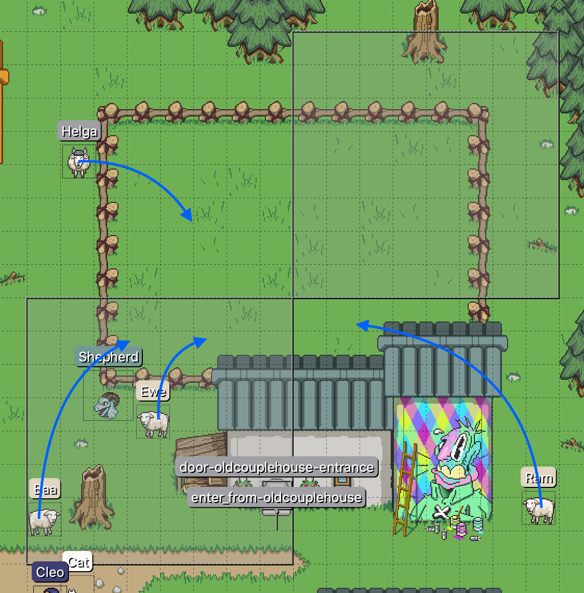

# Vector Objects

Vector objects (also called geometries) can be used as paths or destinations for [[entities|entities]] or the camera. Place these on a [[maps|map]] with Tiled.

Inside [[scripts|scripts]] these are targeted with [[identifiers#Geometry Identifier|geometry identifiers]], which refer to whatever `Name` property the object was given with Tiled. Move entities and the camera to or along vector objects with the [[actions|action phrases]] [[actions#Position Assignment|Position Assignment]] and [[actions#Position Over Time|Position Over Time]].

::: warning
When a vector object has the same name as an entity on the map, you may experience errant behavior. Best to keep all vector objects uniquely named.
:::

The Mage Game Engine (MGE) can detect whether an entity's hitbox is inside a polygon, so polygons are useful for script triggers such as [[doors|doorways]].

All vector objects can be made visible when using [[debug_tools#Vector View|vector view]] while running the game.

## Vector Origins

When a MGE entity is teleported to a vector object (or begins to walk along a vector path), it is moved to the object's **origin**:

- **polyline**: first vertex placed
- **rectancle**: upper-left corner
- **circle**: rightmost point (0º)

## Coordinate Overflow

If a vertex crosses the left and/or top edge of the [[maps|map]] coordinate space, its coordinates will overflow (i.e. become a very, very high value). This can cause unexpected behavior in [[scripts|scripts]] trying to interact with the vector object.

(This goes for the coordinates of [[entities|entities]], too, since they use the map coordinate space.)

## Coordinate Considerations

If designing a puzzle involving X and Y coordinates, you should keep the global [[maps|map]] coordinate space in mind when placing [[entities|entities]], triggers, etc. Each coordinate spans two bytes, so map distances greater than 256 pixels (horizontal or vertical) are guaranteed to involve the more significant byte of the pair, which can be confusing to players not familiar with little endian byte order.

Distances smaller than 256 can involve this byte, too, depending on where things fall. If you find your puzzle has unintentionally crossed a 256px boundary, you can adjust the map size (and reposition all existing elements relative to the new bounds) to move the puzzle to coordinates more in scope of the target difficulty.

### Example

To design and manage puzzles meant only to involve the least significant byte, you could count map tiles for each puzzle element (keeping in mind your map's tile size), but it might be easier to draw a 256 x 256 vector rectangle (or a series of them) where the puzzle is to take place.

 

Lock the layer containing this vector guide and/or place it below all other object layers to keep it from preventing you from selecting other elements in Tiled.
