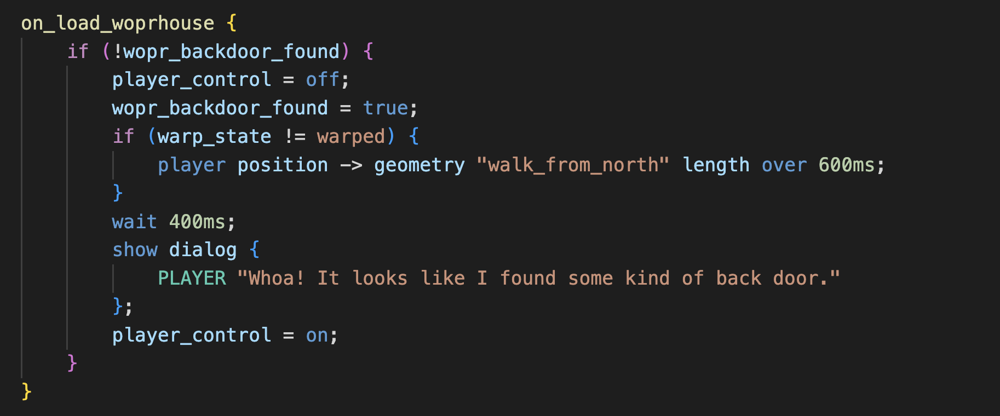

# MageGameScript Documentation and Content Creation Guide

Content creation guide for the "Mage Game Engine" (MGE) using MageGameScript (MGS), a custom domain-specific language.

## Overview

1. [Introduction to MGS](introduction_to_mgs)
	+ [Philosophy](introduction_to_mgs#philosophy)
	+ [New Features](introduction_to_mgs#new-features)
	+ [WIP Features](introduction_to_mgs#wip-features)
	+ [Using the Parser](introduction_to_mgs#using-the-parser)
2. [What You'll Need](what_youll_need)
	* [Software](what_youll_need#software)
	* [Files](what_youll_need#files)
	* [To Run the Game](what_youll_need#to-run-the-game)
	* [Syntax Colors](what_youll_need#syntax-colors)
3. [General Process](general_process)
4. [Documentation Jargon and Syntax](jargon_and_syntax)
	* [General](jargon_and_syntax#general)
	* [Style Guide](jargon_and_syntax#style-guide)
	* [Jargon](jargon_and_syntax#jargon)
	* [Dictionary Syntax](jargon_and_syntax#dictionary-syntax)
5. [MGS Syntax Scopes](syntax_scopes)
	* [Project Scope](syntax_scopes#project-scope)
	* [Map Scope](syntax_scopes#map-scope)
	* [File Scope](syntax_scopes#file-scope)
	* [Session Scope](syntax_scopes#session-scope)
	* [Syntax Contexts](syntax_scopes#syntax-contexts)

## Assets

1. [Tilesets](tilesets)
	* [Map Tilesets](tilesets#map-tilesets)
	* [Spritesheets](tilesets#spritesheets)
	* [Other Kinds of Tilesets](tilesets#other-kinds-of-tilesets)
	* [MGE Considerations](tilesets#mge-considerations)
	* [Creating a Tileset JSON File](tilesets#creating-a-tileset-json-file)
2. [Animations](animations)
	* [MGE Animation Considerations](animations#mge-animation-considerations)
	* [Animation Types](animations#animation-types)
	* [Animation Transitions and Vamping](animations#animation-transitions-and-vamping)
	* [MGE Animation Timing](animations#mge-animation-timing)
	* [Assigning Animations to Character Entities](animations#assigning-animations-to-character-entities)
3. [Maps](maps)
	* [Creating a Map JSON File](maps#creating-a-map-json-file)
	* [Tile Layers](maps#tile-layers)
	* [Object Layers](maps#object-layers)
	* [Map Properties](maps#map-properties)
	* [Map Loads](maps#map-loads)
	* [Map Properties](maps#map-properties)
4. [Vector Objects](vector_objects)
	* [Vector Origins](vector_objects#vector-origins)
	* [Coordinate Overflow](vector_objects#coordinate-overflow)
	* [Coordinate Considerations](vector_objects#coordinate-considerations)
5. [Entities](entities)
	* [Entity Properties](entities#entity-properties)
	* Relative References
6. [Entity Types](entity_types)
	* [Tile Entity](entity_types#tile-entity)
	* [Animation Entity](entity_types#animation-entity)
	* [Character Entity](entity_types#character-entity)
7. [Entity Management System](entity_management_system)
	* [New `entity_type`](entity_management_system#new-entity_type)
	* [Existing `entity_type`](entity_management_system#existing-entity_type)
	* [Animations Pane](entity_management_system#animations-pane)
	* [Tileset Pane](entity_management_system#tileset-pane)
	* [Assigning Animations](entity_management_system#assigning-animations)

## Types and Structure

1. [Primitive Types](primitive_types)
	* [String](primitive_types#string)
		+ [Bareword](primitive_types#bareword)
		+ [Quoted String](primitive_types#quoted-string)
	* [Number](primitive_types#number)
		+ [Number Literal](primitive_types#number-literal)
		+ [Duration](primitive_types#duration)
		+ [Distance](primitive_types#distance)
		+ [Quantity](primitive_types#quantity)
		+ [Color](primitive_types#color)
	* [Boolean](primitive_types#boolean)
	* [Constant](primitive_types#constant)
2. [Dialog and Serial Dialog Strings](dialog_and_serial_dialog_strings)
	* [Wrapping](dialog_and_serial_dialog_strings#wrapping)
	* [Sanitization](dialog_and_serial_dialog_strings#sanitization)
	* [Printing Current Values](dialog_and_serial_dialog_strings#printing-current-values)
		+ [Print Variable Value](dialog_and_serial_dialog_strings#print-variable-value)
		+ [Print Entity Name](dialog_and_serial_dialog_strings#print-entity-name)
	* [Ansi Escape Sequences](dialog_and_serial_dialog_strings#ansi-escape-sequences)
3. [Identifiers](identifiers)
	* [Sigils](identifiers#sigils)
	* [Vs Strings](identifiers#vs-strings)
	* [Identifier Categories](identifiers#identifier-categories)
		+ [Entity Identifier](identifiers#entity-identifier)
		+ [Geometry Identifier](identifiers#geometry-identifier)
4. [Expressions and Operators](expressions_and_operators)
	* [Expressions](expressions_and_operators#expressions)
	* [Assignment Operation](expressions_and_operators#assignment-operation)
	* [Operands](expressions_and_operators#operands)
		+ [Getables vs Setables](expressions_and_operators#getables-vs-setables)
	* [Int Expressions](expressions_and_operators#int-expressions)
		+ [Int Binary Expression](expressions_and_operators#int-binary-expression)
		+ [Int Operands](expressions_and_operators#int-operands)
	* [Bool Expressions](expressions_and_operators#bool-expressions)
		+ [Bool Unary Expression](expressions_and_operators#bool-unary-expression)
		+ [Bool Comparison](expressions_and_operators#bool-comparison)
		+ [Bool Binary Expression](expressions_and_operators#bool-binary-expression)
		+ [Bool Operands](expressions_and_operators#bool-operands)
		+ [Button Names](expressions_and_operators#button-names)
		+ [String Checkables](expressions_and_operators#string-checkables)
5. [Macros](macros)
	* [Include](macros#include)
	* [Rand](macros#rand)
	* [RNG](macros#rng)
	* [Debug](macros#debug)
	* [Copy Script](macros#copy-script)
6. [Fns](fns)
	* [Fn Definition](fns#fn-definition)
	* [Fn Literal](fns#fn-literal)
	* [Fn Call](fns#fn-call)
	* [Example](fns#example)
7. [State](state)
	* [Warp State String](state#warp-state-string)
	* [Integer Variables](state#integer-variables)
	* [Save Flags](state#save-flags)
	* [Engine Flags](state#engine-flags)
	* [Save Data](state#save-data)

## Root Level Definitions

1. [Constants](constants)
	* [Constant Definition](constants#constant-definition)
	* [Use](constants#use)
	* [Vs Integer Variable](constants#vs-integer-variable)
2. [Dialog and Serial Dialog Settings](dialog_and_serial_dialog_settings)
	* [Precedence](dialog_and_serial_dialog_settings#precedence)
	* [Dialog Settings](dialog_and_serial_dialog_settings#dialog-settings)
	* [Serial Dialog Settings](dialog_and_serial_dialog_settings#serial-dialog-settings)
3. [Dialogs](dialogs)
	* [Dialog Definition](dialogs#dialog-definition)
	* [Dialog Literal](dialogs#dialog-literal)
	* [Dialog](dialogs#dialog)
		+ [Dialog Identifier](dialogs#dialog-identifier)
		+ [Dialog Parameter](dialogs#dialog-parameter)
		+ [Dialog Message](dialogs#dialog-message)
		+ [Dialog Option](dialogs#dialog-option)
4. [Serial Dialogs](serial_dialogs)
	* [Serial Dialog Definition](serial_dialogs#serial-dialog-definition)
	* [Serial Dialog Literal](serial_dialogs#serial-dialog-literal)
	* [Serial Dialog](serial_dialogs#serial-dialog)
		* [Serial Dialog Parameter](serial_dialogs#serial-dialog-parameter)
		* [Serial Dialog Message](serial_dialogs#serial-dialog-message)
		* [Serial Dialog Option](serial_dialogs#serial-dialog-option)
5. [Scripts](scripts)
	* [Script Definitions](scripts#script-definitions)
	* [Script Literal](scripts#script-literal)
	* [Script Body Items](scripts#script-body-items)
	* [`null_script`](scripts#null_script)
	* [Script Slots](scripts#script-slots)
		+ [`on_interact`](scripts#on_interact)
		+ [`on_tick`](scripts#on_tick)
		+ [`on_load`](scripts#on_load)
		+ [`on_look`](scripts#on_look)
		+ [One Slot, One Thread](scripts#one-slot-one-thread)

## Script Body Items

1. [Script Control Flow](script_control_flow)
	* [Return](script_control_flow#return)
	* [If / Else Chain](script_control_flow#if--else-chain)
	* [If Single](script_control_flow#if-single)
	* [While Block](script_control_flow#while-block)
	* [Do While Block](script_control_flow#do-while-block)
	* [For Block](script_control_flow#for-block)
	* [Label Definitions](script_control_flow#label-definitions)
2. [JSON Literals](json_literals)
3. [Arrays](arrays)
	* [Array Indices](arrays#array-indices)
	* [Array Action Phrases](arrays#array-action-phrases)
	* [Array Methods](arrays#array-methods)
	* [Assign Array Value at Index](arrays#assign-array-value-at-index)
4. [Commands](commands)
	* [Interpretation](commands#interpretation)
	* [Default Commands](commands#default-commands)
	* [Command Actions](commands#command-actions)
	* [Aliases](commands#aliases)
5. [Action Param Expansions](action_param_expansions)
	* [Spreading](action_param_expansions#spreading)
	* [Rand Macro](action_param_expansions#rand-macro)
	* [Expansion Rules](action_param_expansions#expansion-rules)
6. [Actions](actions)
	* Game Control
		+ [Save slot](actions#save-slot)
		+ [Load Slot](actions#load-slot)
		+ [Erase Slot](actions#erase-slot)
		+ [Non-Blocking Delay](actions#nonblocking-delay)
		+ [Blocking Delay](actions#blocking-delay)
		+ [Load Map](actions#load-map)
	* Dialog Management
		+ [Show Dialog](actions#show-dialog)
		+ [Close Dialog](actions#close-dialog)
		+ [Show Serial Dialog](actions#show-serial-dialog)
		+ [Concat Serial Dialog](actions#concat-serial-dialog)
		+ [Close Serial Dialog](actions#close-serial-dialog)
	* Script Control
		+ [Run Script](actions#run-script)
		+ [Pause or Unpause Script Slot](actions#pause-or-unpause-script)
		+ [Jump to Action Index](actions#jump-to-action-index)
		+ [Jump to Label](actions#jump-to-label)
	+ Choreography
		+ [Position Assignment](actions#position-assignment)
		+ [Position Over Time](actions#position-over-time)
		+ [Play Entity Animation](actions#play-entity-animation)
		+ [Fade Camera In or Out](actions#fade-camera-in-or-out)
		+ [Shake Camera](actions#shake-camera)
	* [Assign a Value](actions#assign-a-value)
		+ [Assign Int Value](actions#assign-int-value)
		+ [Change Int Value](actions#change-int-value)
		+ [Assign Bool Value](actions#assign-bool-value)
		+ [Assign String Value](actions#assign-string-value)
		+ [Assign Script Value](actions#assign-script-value)
		+ [Assign Direction Value](actions#assign-direction-value)
	* [Other Actions](actions#other-actions)

## Techniques

1. [Actors](actors)
2. [Cutscenes](cutscenes)
3. [Doors](doors)
4. [Handlers](handlers)
5. [Hiding an Entity](hiding_an_entity)
6. [Hint Systems](hint_systems)

## Technical

1. [Hex Editor](hex_editor)
	* [Opening the Hex Editor](hex_editor#opening-the-hex-editor)
	* [Selecting a Value](hex_editor#selecting-a-value)
	* [Changing a Value](hex_editor#changing-a-value)
2. [Terminal](terminal)
3. [MGE VM](mge_vm)
4. [Encoder](encoder)
	* [`game.dat`](encoder#game.dat)
	* [CLI Encoder](encoder#cli-encoder)
	* [Web Encoder](encoder#web-encoder)
		+ [Entity Manager](encoder#entity-manager)
	* [Debugging](encoder#debugging)
		+ [Encoder Console](encoder#encoder-console)
		+ [Inspecting WIP Data](encoder#inspecting-wip-data)
		+ [Kaitai](encoder#kaitai)
5. [Debug Tools](debug_tools)
	* [Debug Mode](debug_tools#debug-mode)
	* [Vector View](debug_tools#vector-view)
6. [Updating the Hardware](updating_the_hardware)
	* [Game Engine](updating_the_hardware#game-engine)
	* [`game.dat`](updating_the_hardware#game.dat)

Devs also see: [TODOS](todos)
